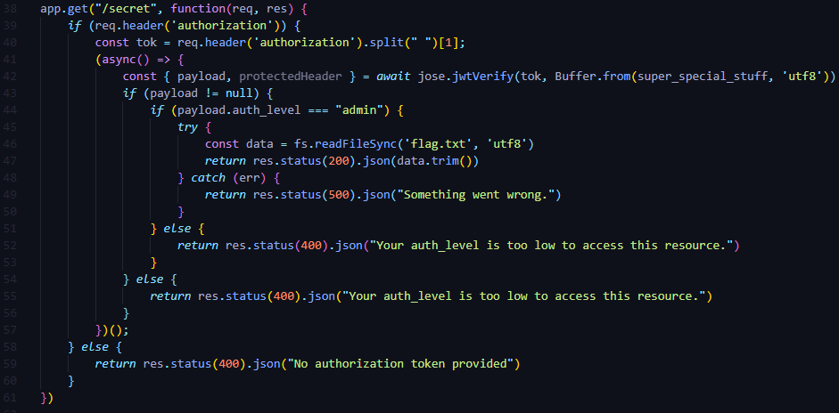

- [RockJWT](#rockjwt)
  - [Going on the site](#going-on-the-site)
    - [JWT Token](#jwt-token)
  - [File main.js](#file-mainjs)
    - [Spot the vulnerability](#spot-the-vulnerability)
    - [Who you? Me? Me admin xD](#who-you-me-me-admin-xd)
  - [Flag](#flag)

# RockJWT
| Type | Difficulty | Points | Site      | Author  | Solved    |
| ---- | ---------- | ------ | --------- | ------- | --------- |
| Web  | Easy       | 200    | DragonCTF | UNKNOWN | 4.10.2022 |

## Going on the site
We inspected the main.js that was downloaded from the site.

### JWT Token
The first thing that I did was crack the JWT token with [jwt-tool](https://github.com/ticarpi/jwt_tool) with the code `python3 jwt-tool.py $cookie -C -d rockyou.txt`.  
I sued the rockyou.txt because it has a lot of passwords.
And we got the password `light_dragon123`
___
## File main.js
I also inspected the main.js that was downloaded from the site. And I quickly saw the `readFileSync(flag.txt)`.

### Spot the vulnerability
We can clearly see that we need to send an `authorization` header to `/secret`.
For that were gonna use burpsuite and change up the headers.
### Who you? Me? Me admin xD
We change the username to admin and encrypt the data with the password using [jwt-tool](https://github.com/ticarpi/jwt_tool) or using the website [jwt.io](https://jwt.io).  
When we send the request, we have to add a header `authorization`.  
So to the header portion of the request we add `Authorization: Basic #jwt-token-here`.  
We send it and we get the flag.

## Flag
dctf{r0cky0u_f0r_7h3_w1n} 