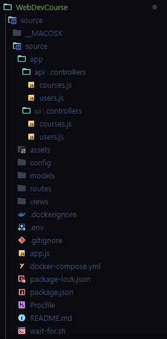
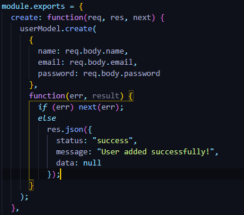
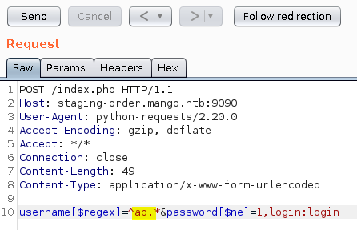

- [WebDevCourse](#webdevcourse)
  - [Going on the site](#going-on-the-site)
    - [A shit tone of code](#a-shit-tone-of-code)
    - [Burpsuite to the resque](#burpsuite-to-the-resque)
    - [Exploiting the vulnerability](#exploiting-the-vulnerability)
  - [Flag](#flag)

# WebDevCourse
| Type | Difficulty | Points | Site      | Author  | Solved    |
| ---- | ---------- | ------ | --------- | ------- | --------- |
| Web  | Medium     | 300    | DragonCTF | TheLara | 4.10.2022 |

## Going on the site
When you go on the site you don't really have much to do. You can make an account and then see course cards but you cant even click on them but that's it. So we have to check the code.

### A shit tone of code
When I downloaded the code I was like what the F**K is this.  
  
I checked every snippet of code that was in here and first of found nothing. After half an hour I found out that the code sanitization is very bad.  
  

### Burpsuite to the resque
I fired up Burp and logged in and saw we sent a request when we log in.
The request has two parameters username and password. Something like this:  
  

### Exploiting the vulnerability
I tried with a comon exploit like this `username=admin&password[$ne]=`.  
So what this means is username should be admin and password should not be equal, `ne = not equal` to empty. But it didn't work.
I searched for other types but they were all JSON format.
So I found a github page where it said that `If the Content-Type is application/x-www-form-urlencoded, changing it to application/json still allows the POST to succeed with POST data`.  
Ok so lets try it. We change the `Content-Type` to json and we use the better payload 
```json
{
    "username":"admin",
    "password":{
        "ne":""
    }
}
```
And it worked.

## Flag
dctf{th1s_W3b_Is_ki11iNg_MEE}