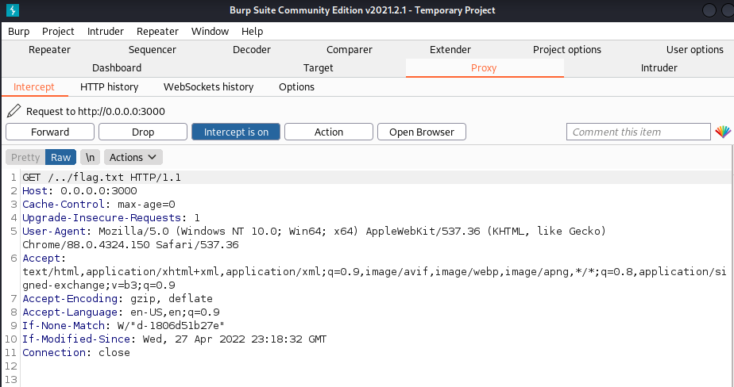
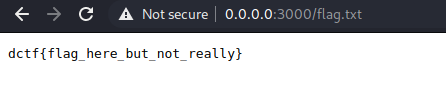

- [Where the Path Leads](#where-the-path-leads)
  - [The site](#the-site)
  - [flag.txt](#flagtxt)
  - [Exploit](#exploit)
  - [Flag](#flag)

# Where the Path Leads
| Type | Difficulty | Points | Site      | Author  | Solved    |
| ---- | ---------- | ------ | --------- | ------- | --------- |
| Web  | Easy       | 100    | DragonCTF | UNKNOWN | 4.10.2022 |

## The site
When I took a look at the site there was nothing special.
But after I checked the files that were downloaded I saw a html file `flag.html`. It was a false positive so no luck there.
But after lookin at the `main.js` file I saw that anything I search it cheecks the curent directory. So no directory traversal through the web browser.

## flag.txt
So I checked the dockerfile for more clues and it said that the flag.txt is one directory behind.

## Exploit
So I fired up BurpSuite and saw that when I send the request, the `/../flag.txt` reverts back to `/flag.txt`. So I just change it in Burp  
  
and it worked  
  

## Flag
dctf{h0w_d1d_y0u_g3t_h3r3}
