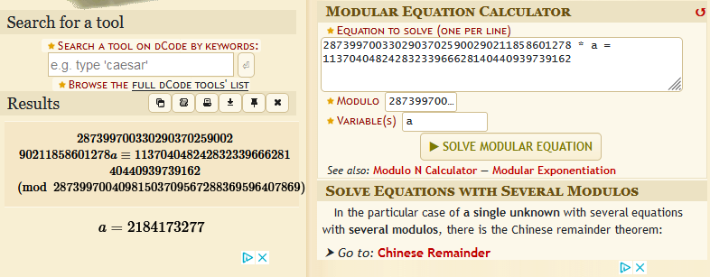
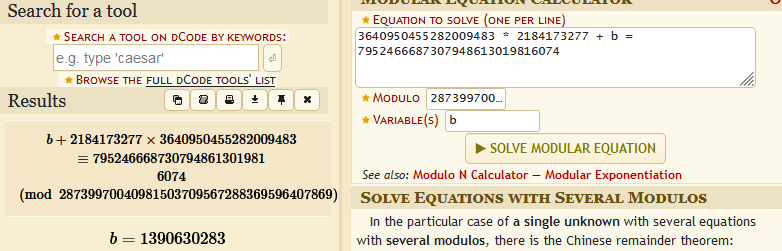

- [Linear Starter Writeup](#linear-starter-writeup)
  - [out.txt](#outtxt)
  - [otp.py](#otppy)
  - [AffineCipher](#affinecipher)
  - [The twist](#the-twist)
  - [Get the otps](#get-the-otps)
  - [Getting the first key](#getting-the-first-key)
    - [Affine cipher process](#affine-cipher-process)
    - [Modular Equation Solver](#modular-equation-solver)
  - [Second key go brrr](#second-key-go-brrr)
  - [Getting the other otp's](#getting-the-other-otps)
  - [Decoding](#decoding)

# Linear Starter Writeup

We are presented with a otp.py and a out.txt.
Out.txt gives us a m which is the modus and a cypher text.

## out.txt
```
######### Output #########
m  28739970040981503709567288369596407869
enc  3640950455282009581 7952466687307948613019816166 17369565224650736430247096541676484812 22953297873638676928488877237515460574 6789459926483754181974800398181847163 23594281354816491687755064935408616946 13599340837403359325873502361810561387 19178280056739850729152448630210469819 5750796724027627985530525957541452882 14899068761052933017575994683202266588 10708609495728939112384997162322651454 24036844658571121697112504137859157324 4617242990748723227674354943304196855 18811895213158432255382911352169730477 19090734008257354768773800356872218807 23781925047665012503501515791546681866 10347259278484713777649406007853539203 17605109204335680853875403098187626639 2130232046631013730828606948294216620 21291605309616464106136625871603541842 15150606512141085908894479535177870451 11797765787966339319703253967573233539 21189076856862287513809886389691260518 754142039204794340361135836514419126 25917710985296323339724454121714117793 10430306687752180036011806859685360248 14155049792151888529548729619035632390 3277912910544070993632544165961133119 24555483850532783362892269386463254744 21851924633623557709496370345447966529 20098849054794528850763913092125585593 22444745345373743765910753631345826657 13200733808198037288814066436970430062 8007919644650239284152245973135853460 4145783825333884041238186581324648059 7949271522783831154823529866563688327 11327815550981551182285405195735287983 15415826677561422516689603695286902950 7368495634839729216447092354421249405 6733239509344973870819169201534188100 5354313196103706975439863056670652201 13376036093138718246443710729245754760 24103815160796670645668570336373371264 4485216241708087407287873644366957244 22487240697267630545487633525954111207 26218250795526710975934739561708728080 404698605898060412543133749966927487 16026843388557166845903618557603773540 4499819451326175246598693217734651275 27802345808115574172733141693429441358 
######### End #########
```

## otp.py
No we look into the otp.py to see whats in there. It's a linear cypher that encodes each character of the flag but with a twist.
```python
from os import urandom
import binascii
import time

flag = r'flag{fake_flag}'

######### Public
m = int(binascii.hexlify(urandom(16)), 16)

######### Secret
a = int(binascii.hexlify(urandom(4)), 16) % m
b = int(binascii.hexlify(urandom(4)), 16) % m

######### Encrypt
otp = []
otp.append(int(time.time()) % m)

for _ in range(50):
    next = (a * otp[-1] + b) % m
    otp.append(next)

enc = ""
for i in range(len(flag)):
    enc += str(ord(flag[i]) ^ otp[i+1]) + " "

print("######### Output #########")
print("m ", m)
print("enc ", enc)
print("######### End #########")
```

We see that there are two secrets used a and b.
```python
######### Secret
a = int(binascii.hexlify(urandom(4)), 16) % m
b = int(binascii.hexlify(urandom(4)), 16) % m
```

Then a encryption is used to make otp's (One-Time-Password).
```python
otp = []
otp.append(int(time.time()) % m)

for _ in range(50):
    next = (a * otp[-1] + b) % m
    otp.append(next)
```
After a long time searching around what this encryption i stumbled uppon [Affine Cipher][AffineCipher].
It's a special cypher that is better explained [here][AffineCipher]

## AffineCipher
The cipher works by using a linear equation to encrypt a letter.
So in our scenario we know the first 5 letters `flag{`.
Thats what we know everything else is a mistery. Whats fun about this cypher is that if you know atleast 2 letters you can crack a and b which are mandatory to decypher.  
Just remember this formula: `f(x) ≡ ax + b (mod m)`

## The twist
We know it's the Affine Cipher but if we would try to decrypt it by following the steps on [the web page][AffineCipher] it wouldn't work. Why? Well because there's a twist. The twist is that the x in theformula is not the letter. The letter is actually xored with the otp `enc += str(ord(flag[i]) ^ otp[i+1]) + " "`.  

## Get the otps
Well we can easily get the otps by just taking the first 5 encrypted letters from the `enc` and just xor them with `ord` of the letter.

| Letter | ord | enc                                    | opt = ord(Letter) ^ enc                |
| ------ | --- | -------------------------------------- | -------------------------------------- |
| f      | 102 | 3640950455282009581                    | 3640950455282009483                    |
| l      | 108 | 7952466687307948613019816166           | 7952466687307948613019816074           |
| a      | 97  | 17369565224650736430247096541676484812 | 17369565224650736430247096541676484781 |
| g      | 103 | 22953297873638676928488877237515460574 | 22953297873638676928488877237515460537 |
| {      | 123 | 6789459926483754181974800398181847163  | 6789459926483754181974800398181847040  |

So now we have the otps. What now? Well now we can use the AffineCipher to actually try and get the first key `a`.

## Getting the first key
Ok so what do we know about otps. Well they're generated with this part of the code `next = (a * otp[-1] + b) % m`. That tells us that the last `otp` is actually the next `otp`s `x`. That makes 0 sence when you just read it like that so let me actually explain it a bit better.  
If we have the formula `f(x) ≡ ax + b (mod m)`. Ok so in this situation the next `otp` will be called `nextOtp`.  
So for us to get the `nextOtp` we use the previous `otp` insteed of `x` so the equation becomes as so `nextOtp = a * otp + b (mod m)`.
Ok that makes more sence. So now we can actually use the [Affine cipher][AffineCipher] process to decode and get the `a`.

### Affine cipher process
We need two equations or more.
1. `3640950455282009483 * a + b = 7952466687307948613019816074`
2. `7952466687307948613019816074 * a + b = 17369565224650736430247096541676484781`

Then we minus out the two equations.  
We do first equation minus the second equation and if the number is negative we sum together the negative number and the modus.
`3640950455282009483 - 7952466687307948613019816074 + 28739970040981503709567288369596407869 = 28739970033029037025900290211858601278`  
`7952466687307948613019816074 - 17369565224650736430247096541676484781 + 28739970040981503709567288369596407869 = 11370404824283233966628140440939739162`  
After that we get a new equation that only has one unknown variable and that is the `a` key.  
New equation looks like `28739970033029037025900290211858601278 * a = 11370404824283233966628140440939739162`  

### Modular Equation Solver
Now we can use the online [Modular Equation Solver][MES].
  
We get `a = 2184173277`.

## Second key go brrr
Now we can inster the `a` key into the previous equation and get the other `b` key.
  
And so there it is the `b` `b = 1390630283`.

## Getting the other otp's
So we know the first 5 `otp`'s. But what about the others. Well now we can generate the rest of the `otp`s using the `a` and `b` key using this simple script.  
```python
for _ in range(50):
    next = (a * otp[-1] + b) % m
    otp.append(next)

print(otp)
```

## Decoding
After getting all the `otp`'s we can decode the `enc` text.  
```python
text = ""
for i in range(len(encoded)):
    text+= chr(encoded[i]^otp[i])

print(text)
```


[AffineCipher]: <http://mathcenter.oxford.emory.edu/site/math125/breakingAffineCiphers/>
[MES]: <https://www.dcode.fr/modular-equation-solver>